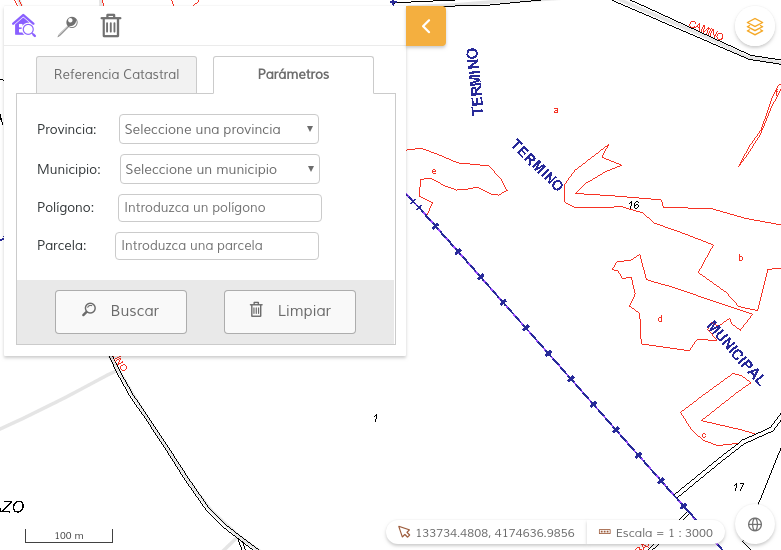
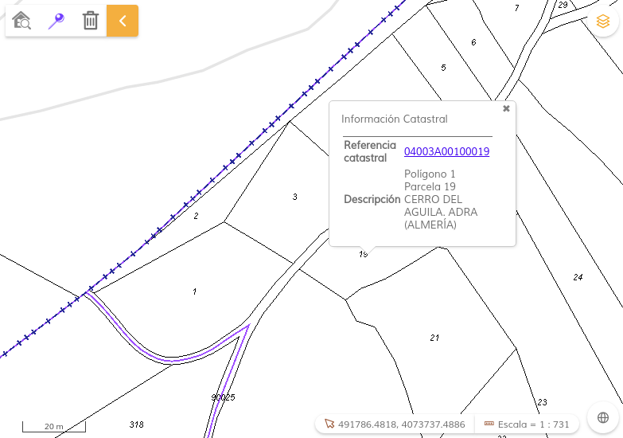

# localizador-catastral 

[](https://github.com/sigcorporativo-ja/Mapea4-dev)  

## Descripción
Plugin para [Mapea](https://github.com/sigcorporativo-ja/Mapea4) desarrollado por la Consejería de Medioambiente y Ordenación del Territorio de la Junta de Andalucía. Crea un panel propio con un control de búsqueda catastral contra los [Servicios Web de Catastro](http://www.catastro.meh.es/esp/sede.asp) públicos, en dos modalidades:  
* Búsqueda por referencia catastral o parámetros (municipio, provincia, polígono y parcela)  
* Búsqueda por click en posición  
* Limpiar resultados  
 
La búsqueda por Referencia Catastral o por parámetros permite localizar elementos castastrales en el mapa.

  

  

La búsqueda por posición devuelve la información del elemento castastral encontrado en el punto sobre el que se pincha. Dicha información incluye un enlace a su ficha en la web de Catastro.  

  

El plugin carga opcionalmente la capa WMS de Catastro, si así se le especifica en los parámetros de configuración.

## Recursos y uso

- js: catasro.ol.js
- css: catasro.min.css
- / fonts

El plugin recibe un {object}, que deberá tener como parámetros las distintas urls de servicio de Catastro que se necesitan:  

Parámetro | Descripción 
--- | --- |
**RCCOOR_url** | string - Consulta de Referencia Catastral por Coordenadas. |  
**CMC_url** | string - Consulta de municipios para una provincia.|  
**DNPRC_url** | string - Consulta de datos no protegidos para un inmueble por su referencia catastral.|  
**CPMRC_url** | string - Consulta de coordenadas por Provincia, Municipio y Referencia Catastral.|  
**DNPPP_url** | string - Consulta de datos no protegidos para un inmueble por su polígono y parcela.|  
**catastroWMS** | _Opcional_ - {object} - Si se especifica, se añadirá la capa WMS de Catastro al mapa <br>**wms_url**: string - Url WMS del servicio de mapas de Catastro <br>**name**: string - Nombre de la capa catastral en el servicio WMS

Ejemplos:

```javascript
var myMap = M.map({
		container: "map",
		controls: ['scale', 'scaleline', 'mouse', 'overviewmap','layerswitcher'],
		wmcfile: ["cdau"]
	});

var catastroSearchConfig = {
		config: {
			RCCOOR_url: 'http://ovc.catastro.meh.es/ovcservweb/OVCSWLocalizacionRC/OVCCoordenadas.asmx/Consulta_RCCOOR',
			CMC_url: 'http://ovc.catastro.meh.es/ovcservweb/OVCSWLocalizacionRC/OVCCallejeroCodigos.asmx/ConsultaMunicipioCodigos',
			DNPRC_url: 'http://ovc.catastro.meh.es/ovcservweb/OVCSWLocalizacionRC/OVCCallejeroCodigos.asmx/Consulta_DNPRC_Codigos',
			CPMRC_url: 'http://ovc.catastro.meh.es/ovcservweb/OVCSWLocalizacionRC/OVCCoordenadas.asmx/Consulta_CPMRC',
			DNPPP_url: 'http://ovc.catastro.meh.es/ovcservweb/OVCSWLocalizacionRC/OVCCallejeroCodigos.asmx/Consulta_DNPPP_Codigos',
			catastroWMS: {
			    wms_url: 'https://ovc.catastro.meh.es/Cartografia/WMS/ServidorWMS.aspx?',
			    name: 'Catastro'
			}
		}
};	

var pluginCatastro = new M.plugin.Catastro(catastroSearchConfig);
myMap.addPlugin(pluginCatastro);
```
El plugin ofrece métodos de acceso para las dos capas que usa internamente, de modo que puedan manipularse desde el exterior del mismo, si así se desea: 
* Una capa vectorial de tipo POINT donde se dibujan los puntos que sirven para localizar los elementos catastrales, en base a la coordenada de la respuesta del servicio de búsqueda:
```javascript
// Ej: asignar un estilo a la capa
let layerVectorial = pluginCatastro.getResultsLayer();
	let estilo1 = new M.style.Point({
       fill: {  
         color: 'red',
       },
       stroke: {
        color: 'black'
       }
    });

layerVectorial.setStyle(estilo1);
```

* La capa WMS de Catastro, si se activa al construir el plugin:
```javascript
// Ej: quitar la capa WMS del TOC
let capasWMS = pluginCatastro.getWMSCatastroLayer();
capaWMS.displayInLayerSwitcher = false;
```